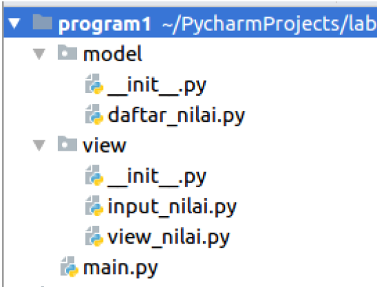
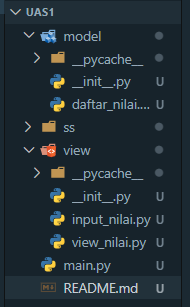
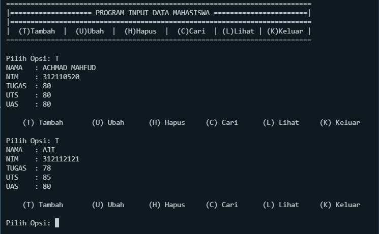
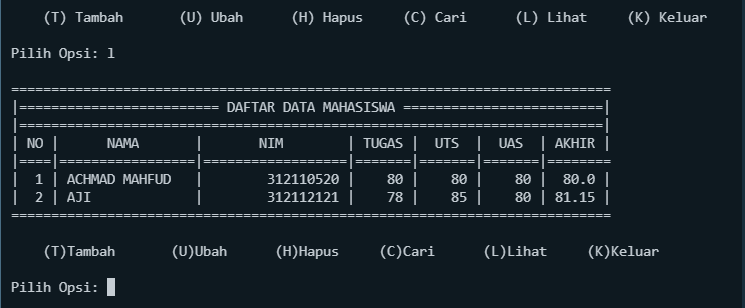
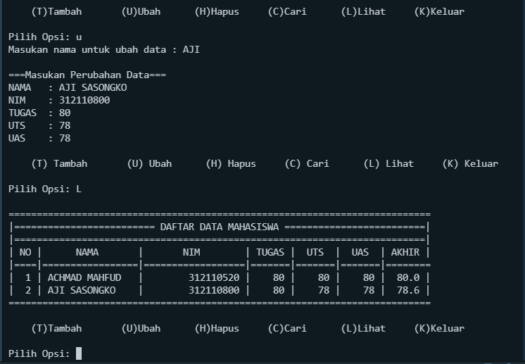
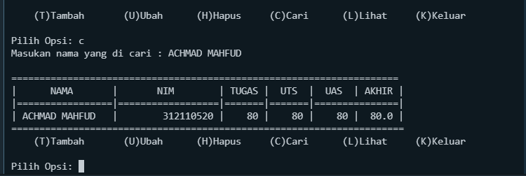
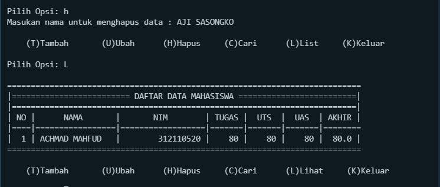
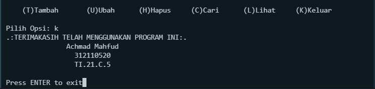

# 
 **UJIAN AKHIR SEMESTER 1**

## **Perintah :**

Buatlah package dan modul dengan struktur seperti berikut:
- daftar_nilai.py berisi modul untuk: tambah_data, ubah_data, dan cari_data
- view_nilai.py berisi modul untuk: cetak_daftar_nilai, cetak_hasil_pencarian
- input_nilai.py berisi modul untuk: input_data yang meminta pengguna memasukkan data
- main.py berisi program utama(menu pilihan yang memanggil semua menu yang ada)

## **Hasil Output Program :**

- View Package

- Output tambah_data
  

- Output daftar_nilai

- Output ubah_data

- Output cari_data

- Output hapus_data

- Output Break

# 
 **TERIMAKASIH**